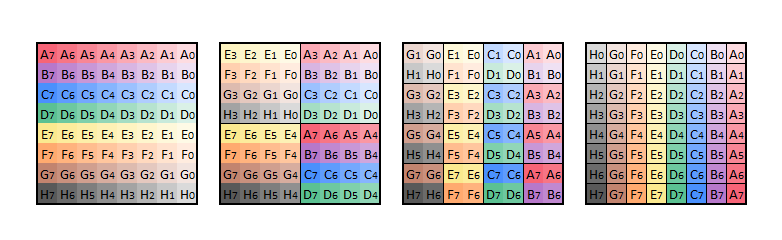

# Base idea
Transposes a 32x32 bit matrix *really* (Some might even say *blazingly*) fast. This is done through a modified divide and conquer approach. Refer to this image stolen from [here](https://github.com/dsnet/matrix-transpose?tab=readme-ov-file) which has been slightly modified, because it looked weird on github (Note that the image shows a transpose around the top-right to bottom-left diagonal. Implementation is a transpose around the top-left to bottom-right diagonal):


# Implementation details related to SIMD registers
Due to this bit matrix transpose using SIMD registers, the data is swizzled around so that it can all be operated upon at once. This means that for the first transpose (In the image), one would imagine two SIMD registers one for the top 8x4 of the bits, and one for the bottom 8x4 of the bits. Let's call them register 1 and 2. A mask, 0b11110000, is applied to register 1, selecting the left most bits. Then the same mask is applied to register 2. The result of applying this mask to register 2, is then shifted to the right by 4. This is or'ed together with the result of applying the mask to register 1. This transposes the the top row, of the bottom left 4x4 square, to the top row of the top right 4x4 square:

```
Initial state:
Register 1: 11010010
Register 2: 10010110

Masking:
Register 1: 11010010
       and: 11110000
    equals: 11010000

Register 2: 10010110
       and: 11110000
    equals: 10010000
 shifted 4: 00001001

Or'ing:
Register 1: 11010000
Register 2: 00001001
        or: 11011001

Completed state:
Register 1: 11011001
Register 2: N/A
```

This example only shows a single row, but for a 4 lane SIMD register, this would happen to 4 rows at a time. Note that the top lane of register 1, is compared to the top lane of register 2, and the second-top-most lane of register 1 is compared with the second-top-most lane of register 2. For the very first part of the transpose, this functions well, however when the transpose is at the 2x2 level instead of 4x4 (Still refering to the image), this doesn't work anymore. One would want to compare row 0 and 1 with row 2 and 3 now, instead of row 0 to 3 with row 4 to 7. This worked before, because the rows were in different registers, however now both row 0 and 1 and row 2 and 3 are in register 1. Therefore swizzling is perfomed, to move row 0, 1, 4 and 5 to register 1, and row 2, 3, 6 and 7 to register 2. For the entire process, the rows are swizzled around like this:

```
4x4:
Register 1   Register 2
Row 0        Row 4
Row 1        Row 5
Row 2        Row 6
Row 3        Row 7


2x2
Register 1   Register 2
Row 0        Row 2
Row 1        Row 3
Row 4        Row 6
Row 5        Row 7

1x1
Register 1   Register 2
Row 0        Row 1
Row 2        Row 3
Row 4        Row 5
Row 6        Row 7
```

The same and'ing and or'ing is happening in each process, but the mask and shift amount is changed per step:
```
4x4:
Mask:  0b11110000
Shift: 4

2x2:
Mask:  0b11001100
Shift: 2

1x1:
Mask:  0b10101010
Shift: 1
```
So far only the top register result has been shown, but the process is the same for the bottom register, however the mask is inverted, and the shift is left instead of right. Of course, the rows are in the wrong order when the transpose is finished, however this can be fixed with another swizzle.

# Performance
The code has been run on an AMD Ryzen 7 5800H. When using 128-bit SIMD registers, each transposition is about 13.4 nanoseconds, and when using 256-bit SIMD registers (AVX2), each transposition is about 10.5 to 10.7 nanoseconds. The code was also tested on an AMD Ryzen 9 9950x3D, which achieved results of 8.52 nanoseconds per transpose, when using 512-bit SIMD registers. 
Although I am not entirely sure, I think that there isn't really a single bottleneck that can be optimized away. I looked at the LLVM MCA timeline output, and it looks like most of the time is simply used on waiting for other instructions to finish — those instructions taking one clock cycle to compute each, so not much to be done there as far as I'm aware. 

# Resources
[Hacker Delight](http://www.icodeguru.com/Embedded/Hacker's-Delight/048.htm) (In case this is taken down, the book is called `Hackers Delight`, and the chapther is 7-3)<br>
[Bit-Matrix transpose](https://github.com/dsnet/matrix-transpose?tab=readme-ov-file)

# Licensing
The project is licensed under the MIT license, and can be used freely. 

# Full example of bits in registers
Below is a full example of how the bits move around in the registers, during the transpose. The example uses a 4x4 matrix, but the concept is the same, regardless of size. Each bit is labeled A through P, so that it can be tracked. While what is show below, is how the transpose is implemented in the code, the compiler does some intrinsic magic, which means that the assembly does not perfectly reflect the code.

```
01: Input: 
A B C D
E F G H
I J K L
M N O P

02: Register 1:
A B C D
E F G H

03: Register 2:
I J K L
M N O P

04: Results stored in Register 3 (Register 1 & 1100):
A B C D
E F G H
&
1 1 0 0
1 1 0 0
=
A B 0 0
E F 0 0

05: Results stored in Register 4 (Register 2 & 1100):
I J K L
M N O P
&
1 1 0 0
1 1 0 0
=
I J 0 0
M N 0 0

06: Results stored in Register 4 (Register 4 >> 2):
I J 0 0
M N 0 0
>> 2
0 0 I J
0 0 M N

07: Results stored in Register 3 (Register 3 | Register 4):
A B 0 0
E F 0 0
|
0 0 I J
0 0 M N
=
A B I J
E F M N

08: Results stored in Register 2 (Register 2 & 0011):
I J K L
M N O P
&
0 0 1 1
0 0 1 1
=
0 0 K L
0 0 O P

09: Results stored in Register 1 (Register 1 & 0011):
A B C D
E F G H
&
0 0 1 1
0 0 1 1
=
0 0 C D
0 0 G H

10: Results stored in Register 1 (Register 1 << 2):
0 0 C D
0 0 G H
<< 2
C D 0 0
G H 0 0

11: Results stored in Register 4 (Register 1 | Register 2):
C D 0 0
G H 0 0
|
0 0 K L
0 0 O P
=
C D K L
G H O P

Intermediate results (Note that the original values in Register 1 and 2 have been overwritten)

Register 1:
C D 0 0
G H 0 0
Register 2:
0 0 K L
0 0 O P
Register 3:
A B I J
E F M N
Register 4:
C D K L
G H O P

Note that the values in Register 3 and 4 hold the results of the 2x2 swap, where the top right and bottom left 2x2 squares have been swapped. Now only a 1x1 swap is needed. When swizzling (The next step), imagine the rows/lanes in the SIMD registers as extending each other, as were it an array:

12: Results stored in Register 1 (Swizzle Register 3 and Register 4, take row 0 and 2):
A B I J << This row taken
E F M N
Swizzle
C D K L << This row taken
G H O P
=
A B I J
C D K L

13: Results stored in Register 2 (Swizzle Register 3 and Register 4, take row 1 and 3):
A B I J
E F M N << This row taken
Swizzle
C D K L
G H O P << This row taken
=
E F M N
G H O P

14: Results stored in Register 3 (Register 1 & 1010):
A B I J
C D K L
&
1 0 1 0
1 0 1 0
=
A 0 I 0
C 0 K 0

15: Results stored in Register 4 (Register 2 & 1010):
E F M N
G H O P
&
1 0 1 0
1 0 1 0
=
E 0 M 0
G 0 O 0

16: Results stored in Register 4 (Register 4 >> 1):
E 0 M 0
G 0 O 0
>> 1
0 E 0 M
0 G 0 O

17: Results stored in Register 3 (Register 3 | Register 4):
A 0 I 0
C 0 K 0
|
0 E 0 M
0 G 0 O
=
A E I M
C G K O

18: Results stored in Register 2 (Register 2 & 0101):
E F M N
G H O P
&
0 1 0 1
0 1 0 1
=
0 F 0 N
0 H 0 P

19: Results stored in Register 1 (Register 1 & 0101):
A B I J
C D K L
&
0 1 0 1
0 1 0 1
=
0 B 0 J
0 D 0 L

20: Results stored in Register 1 (Register 1 << 1):
0 B 0 J
0 D 0 L
<< 1
B 0 J 0
D 0 L 0

21: Results stored in Register 4 (Register 1 | Register 2):
B 0 J 0
D 0 L 0
|
0 F 0 N
0 H 0 P
=
B F J N
D H L P

22: Results stored in Register 1 (Swizzle Register 3 and Register 4, take row 0 and 2):
A E I M << This row taken
C G K O
Swizzle
B F J N << This row taken
D H L P
=
A E I M
B F J N

23: Results stored in Register 2 (Swizzle Register 3 and Register 4, take row 1 and 3):
A E I M 
C G K O << This row taken
Swizzle
B F J N 
D H L P << This row taken
=
C G K O
D H L P

Final results:
Register 1:
A E I M
B F J N
Register 2:
C G K O
D H L P

Output:
A E I M
B F J N
C G K O
D H L P
```

Each swap consists of two "parts" (Using the term parts loosely). The first part, where the top transposition is done, and the second part where the bottom transposition is done. A top transposition can be seen from step 4-7 — here the bottom left 2x2 square is transposed to the top right 2x2 square. The results of this "top transpose" are temporarily stored in Register 3. After this, a bottom transposition is performed from step 8 to 11. During this transposition, the 1 and 2 registers are used as temporary registers, whereas the 3 and 4 registers are used as temporary registers during the top transposition. The final result of the bottom transposition is stored in Register 4. Register 3 and 4 can now be moved back to Register 1 and 2, and the process of swapping temporary/storing registers repeats.